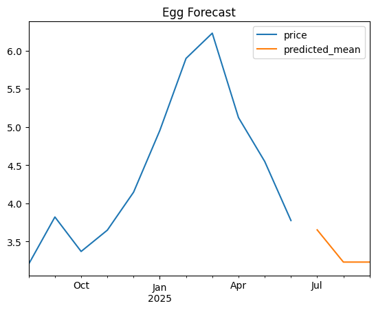
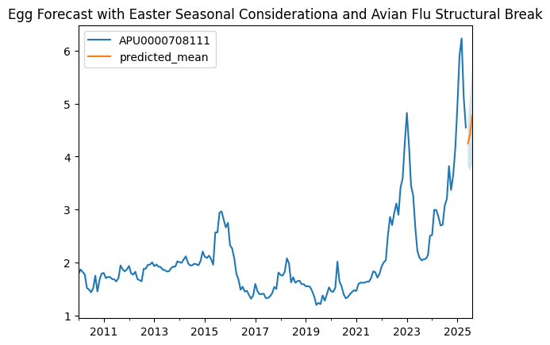
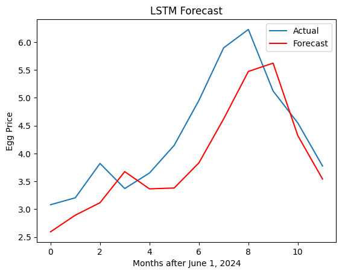
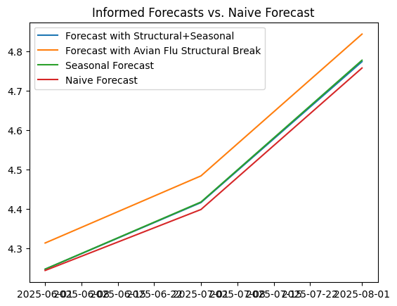
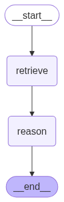
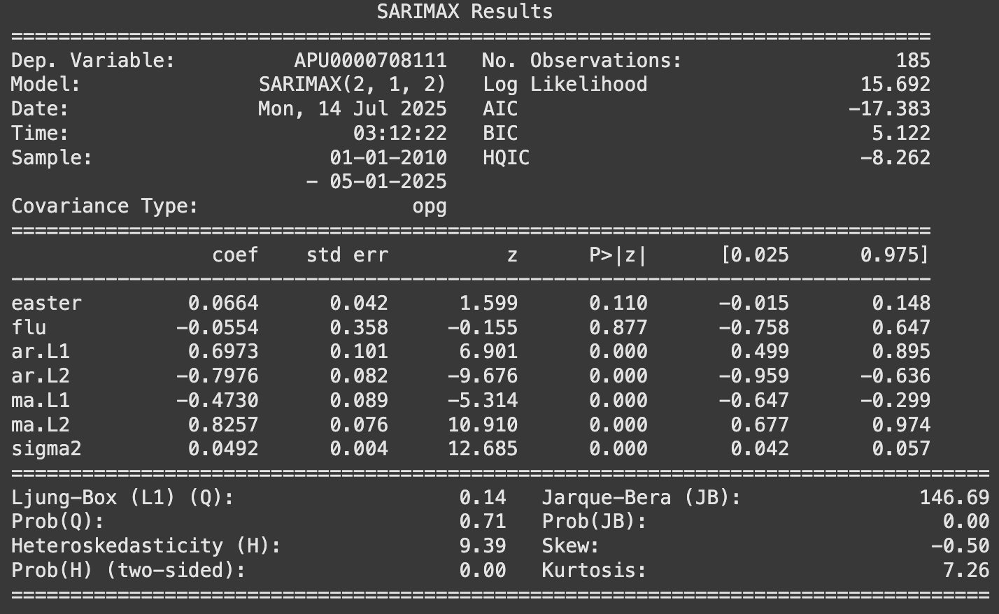

# Unscrambled_Futures
*Sandbox of classical time-series forecasting and machine learning models incorporating agentic news‑reasoning and real‑time sentiment analysis for automated trading within the US egg market.*

---

## 1  What is Unscrambled Futures?

Unscrambled Futures ingests USDA market bulletins and  news headlines and invokes a LangGraph workflow that converts each news article into a numeric daily sentiment score.
These scores, together with lags, rolling stats, seasonal effects (Easter), and structural breaks (2022 Avian Flu Outbreak) serve as features for four main forecasters: SARIMAX, XGBoost, Long Short-Term Memory (LSTM) Network, and Temporal Fusion Transformer (TFT).
The resulting forecasts can be used to automatically trade on Kalshi's "Egg Prices This Month" Market.

---

## 2  Implementation Details

1. **Ingest & Vectorise**: Pull news via NewsAPI, embed within sentence transformer (Sentence‑T5), store in FAISS.
2. **Agent Reasoning**: LangGraph pipeline `Retriever → Reasoner (GPT‑4o / FinBERT fallback)` outputs impact score JSON.
3. **Monthly Feature Build**: Aggregate daily impact × confidence --> `news_price_score`.
4. **Model Suite**:
   *SARIMAX with order determination via ACF, PACF, KPSS, ADF and includes exogenous features*,
   *XGBoost 400 estimators with a max depth of 4*,
   *LSTM *,
   *TFT 32‑hid 4‑head*
5. **Trade Based on Model Forecasts**: Kalshi API

---

## 3  Results

While not all strategies performed well (ex. TFT), some sample results on the more successful strategies are shown.

<table>
  <tr>
    <td align="center">
       
      <em>Forecast of SARIMAX with Agentic News Scoring Feature</em>
    </td>
    <td align="center">
       
      <em>Forecast of Basic SARIMAX</em>
    </td>
  </tr>
  <tr>
    <td align="center">
       
      <em>LSTM Validation Performance</em>
    </td>
    <td align="center">
       
      <em>Forecast of basic ARIMA vs SARIMAX with Exogenous Features</em>
    </td>
  </tr>
  <tr>
    <td align="center">
       
      <em>Graph Illustration of the Simple Agentic Workflow</em>
    </td>
    <td align="center">
       
      <em>SARIMAX Model Summary</em>
    </td>
  </tr>
</table>

---

## 4  Persisting Issues / TODO

1. Backtest strategies.
2. Complete full E2E framework with LangGraph nodes of `forecast` and `execute trade`.

---

## 5  Conclusion

Without any information about the news, models tended to predict egg prices to bounce back throughout the rest of the summer. However, given the news scores feature, models began to forecast a continual decline in prices. However, the strategy has not yet been backtested, so these forecasts are unverified.

---

## 6  License

This project is licensed under the MIT License – see `LICENSE` for details.
